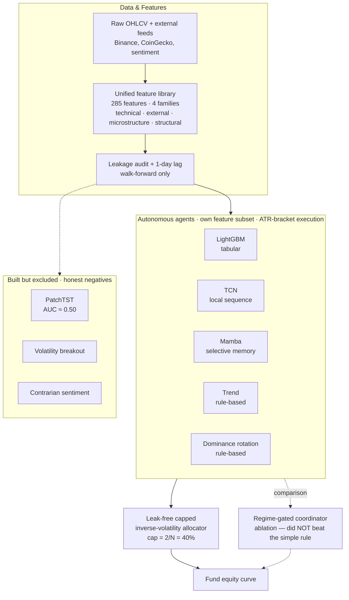

# Hybrid Multi-Agent Trading System Integrating Heterogeneous AI Methods

A small **fund of autonomous trading agents** for Bitcoin (BTC/USDT), where each agent
is built on a deliberately different AI paradigm — gradient boosting, temporal
convolutions, a selective state-space model, transformer attention, and classical
rule-based logic. The agents are combined into a single equity curve by a leak-free,
risk-balanced capital allocator.

The guiding idea is **heterogeneity as a source of resilience**: when agents fail in
uncorrelated ways, the portfolio stays steadier than any one of them alone.

> 📄 **Master's thesis (full write-up):**
> [`latex_thesis/.../Thesis.pdf`](latex_thesis/Master_Thesis___Hybrid_Multi_Agent_Trading_System/Thesis.pdf)
> A plain-language walkthrough (Polish, "with a cup of coffee") lives in
> [`docs/historia_pracy_pl.md`](docs/historia_pracy_pl.md).

## Architecture



**The five-agent predeclared roster:** LightGBM, TCN, Mamba (learned) + trend following
and dominance rotation (rule-based). Each carries its own feature subset, directional
signal, and risk-managed execution, and produces an independent return stream. PatchTST,
volatility breakout, and contrarian sentiment were built and analysed but excluded for
stated, pre-hold-out reasons.

## Results

Two-year out-of-sample window (**1 Jun 2024 – 31 May 2026**) spanning three market
regimes (bull, bear, chop). All backtests use realistic retail fees and ATR-bracket
execution.

| Strategy | Return | Sharpe | Max drawdown |
|---|---:|---:|---:|
| **Fund — capped inverse-volatility** | **+53.7%** | **1.50** | **−9.2%** |
| Fund — equal-weight baseline | +56.1% | 1.48 | similar |
| Regime-gated coordinator (ablation) | −10.2% | −0.23 | −32.7% |
| Bitcoin buy-and-hold | — | 0.09 | −50% |
| S&P 500 | — | 1.16 | — |

**What the numbers say**

- **The edge is risk-adjusted, not raw return.** The fund posts the highest Sharpe and the
  shallowest drawdown, turning volatile individual streams into a smoother portfolio.
- **The value is in the diverse roster, not the weighting rule.** The capped allocator (1.50)
  barely edges equal-weight (1.48); a 5,000-draw random-weighting test confirms almost all
  the benefit comes from *holding* the diversified roster.
- **A learned coordinator did not help.** The "intelligent" regime-gated controller lost to
  the simple risk-parity rule — adaptive weighting adds estimation noise on short, noisy data.
- **High return ≠ skill.** The dominance agent's large return sits at ~the 95th percentile of
  its own random-bracket null, so it is included as a *diversifier*, not as proven alpha.
- **Robust but modest.** A block bootstrap gives a Sharpe 95% CI of `[0.46, 2.56]` with
  `P(Sharpe > 0) = 0.99`.

This is **promising research evidence under limited data access, not a strategy proven ready
to trade** — the main remaining uncertainty is real-world execution (slippage, latency, fills).

## Repository layout

| Path | Contents |
|---|---|
| `src/hmats/` | Core package — `agents/`, `coordinator/`, `mas/`, `features/`, `evaluation/`, `data/`, `viz/` |
| `artifacts/` | Per-experiment run outputs (models, backtests, notebooks) |
| `docs/` | Design notes, feature reference, red-team audits, analysis write-ups |
| `latex_thesis/` | LaTeX source and compiled `Thesis.pdf` |
| `lab/`, `local/` | Exploratory notebooks and archived experiments |

## Documentation

- [`docs/features.md`](docs/features.md) — **Read before training any model.** All feature
  sets and the 4-stage selection pipeline (Variance+Corr → MI Top-60 → Walk-forward
  stability → Permutation pruning), with per-experiment backtest results.
- [`docs/system_architecture.md`](docs/system_architecture.md) — System architecture detail.
- [`docs/strategy_evaluation.md`](docs/strategy_evaluation.md) — Evaluation methodology.
- [`docs/glossary.md`](docs/glossary.md) — Key terms.
- [`docs/historia_pracy_pl.md`](docs/historia_pracy_pl.md) — Plain-language story of the
  whole thesis (Polish), with simple worked examples and a glossary.
- [`docs/audit_redteam.md`](docs/audit_redteam.md), [`docs/audit_redteam_2.md`](docs/audit_redteam_2.md) —
  Adversarial ("red-team") audits of the system's claims.

## Getting started

The project uses [`uv`](https://github.com/astral-sh/uv) (Python ≥ 3.12):

```bash
uv sync    # install dependencies from uv.lock
```

See the `Makefile` for common tasks.
