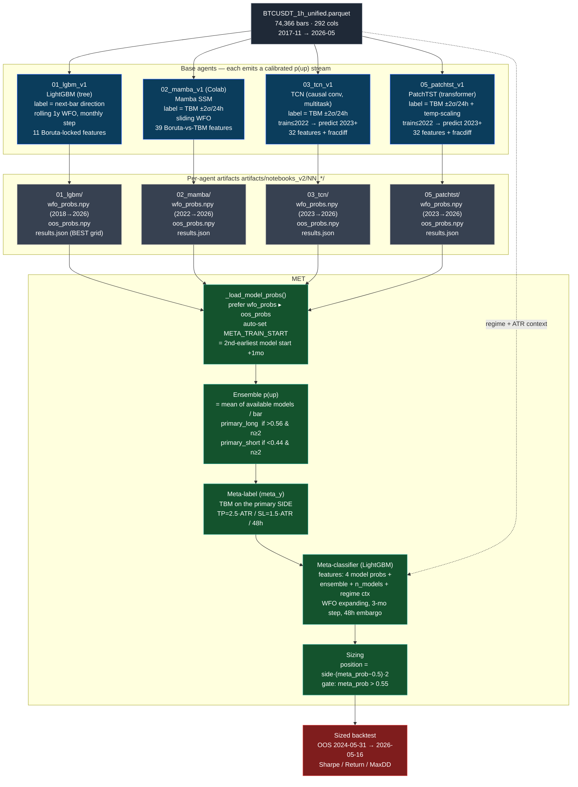

# Agent Communication — `notebooks_v2` Ensemble (2026-06-11)

How the four base agents and the meta-learner exchange data. This reflects the
**current** `notebooks_v2/` pipeline (not the older `notebooks/` DRL+GP design in
`system_architecture.md`, which is stale).

## Communication contract

| Edge | Payload | Format | Coverage required |
|---|---|---|---|
| base → artifact | `p(up)` per bar | `wfo_probs.npy` + `wfo_index.npy` (int64 ns) | **Must span meta-train + OOS** |
| base → artifact | OOS `p(up)` | `oos_probs.npy` + `oos_index.npy` | OOS only |
| base → meta | tuned trading rule | `results.json["best_params"]` | **Currently unused by meta** ⚠ |
| artifact → meta | aligned probs | reindexed to parquet index, NaN where uncovered | ≥2 models per bar to fire |
| meta → exec | continuous position | `[-1,+1]` | OOS window |

⚠ **Key gap:** each base agent also publishes a *tuned* `best_params` trading rule
(thresholds, SL/TP, holds) that produced its standalone backtest edge — but the meta
ignores it and re-derives signals from raw probabilities with one fixed untuned rule.
See `docs/meta_analysis_2026-06-11.md` §3.
