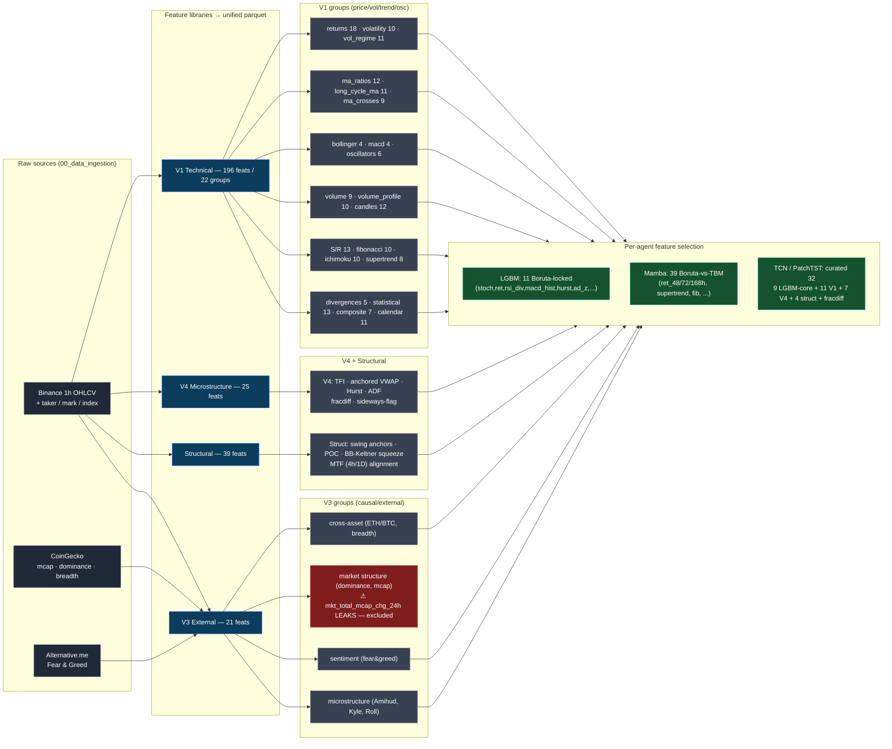

# Feature Creation Pipeline (2026-06-11)

The unified parquet (`BTCUSDT_1h_unified.parquet`, 292 columns) is assembled from four
feature libraries built on raw data, then each agent draws its own subset. Group counts
are from `docs/features.md`.

## Excluded-from-ML columns

`{open, high, low, close, volume, label}` (targets/raw OHLCV used only for
labelling + backtest) and **`mkt_total_mcap_chg_24h`** (confirmed forward-leak:
+0.44 corr with the future 24h move — see `MEMORY.md` / `project_mcap_feature_leak`).
