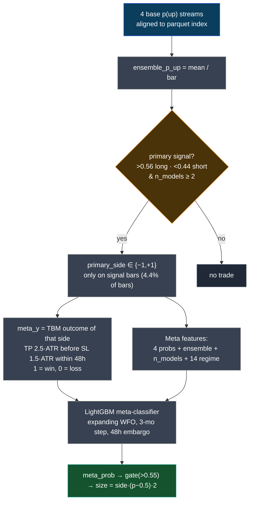
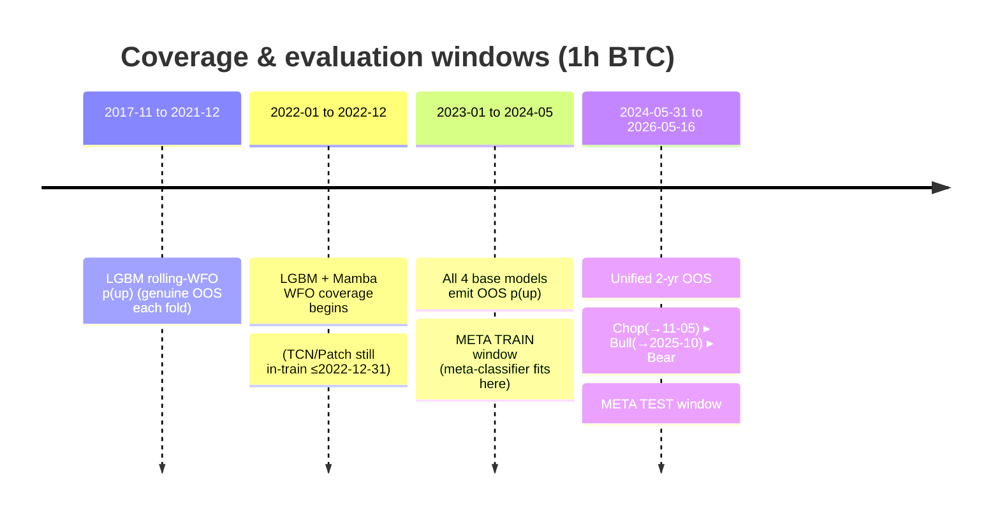
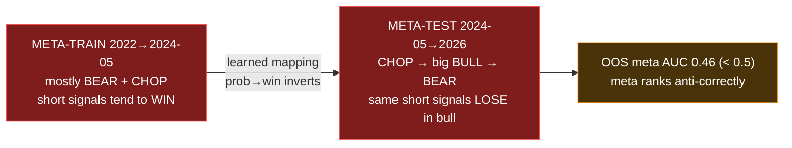

# Meta-Learning Data Flow & Walk-Forward Timeline (2026-06-11)

## 1 · Meta-labeling data flow

## 2 · Walk-forward timeline (who is trained on what)

## 3 · The regime-mismatch problem (why meta AUC < 0.5)

The base agents' grids were tuned on the **2022→2024-05 grid-val window**, which is
predominantly bearish/choppy → they are **short-biased** (Mamba 244S/70L, TCN 232S/40L,
PatchTST 129S/0L). The meta then learns "shorts pay" from a bearish train window and
mis-ranks them through the 2024-11 → 2025-10 bull.
