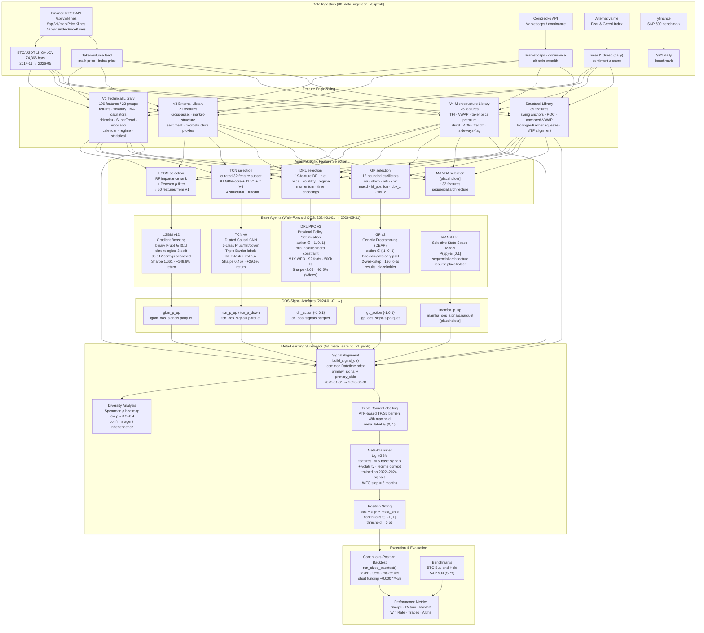

# Hybrid Multi-Agent Trading System — Architecture Diagram

## Full Pipeline

## Agent Signal Types

| Agent | Signal | Range | Paradigm |
|-------|--------|-------|----------|
| LGBM v12 | `lgbm_p_up` | [0, 1] continuous | Gradient boosting (tabular) |
| TCN v0 | `tcn_p_up`, `tcn_p_down` | [0, 1] continuous | Dilated causal CNN (sequential) |
| DRL PPO v3 | `drl_action` | {−1, 0, +1} discrete | Reinforcement learning |
| GP v2 | `gp_action` | {−1, 0, +1} discrete | Evolutionary symbolic regression |
| MAMBA v1 | `mamba_p_up` | [0, 1] continuous | Selective state-space model |
| **Meta-Supervisor** | **position** | **[−1, +1] continuous** | **Meta-labeling (LightGBM)** |

## Walk-Forward OOS Configuration

| Agent | Train window | Step size | Folds (total) | OOS folds (from 2024-01) |
|-------|-------------|-----------|--------------|--------------------------|
| LGBM v12 | chronological split | — | 1 | 1 test set |
| TCN v0 | pre-2024 | — | 1 | 1 test set |
| DRL PPO v3 | 8,760h (1 year) | 720h (1 month) | 92 | 29 |
| GP v2 | 8,760h (1 year) | 336h (2 weeks) | 196 | 62 |
| MAMBA v1 | pre-2024 | — | 1 | 1 test set |
| Meta-Supervisor | 2022–2024 signals | 3 months | WFO | OOS 2024-01 → |
