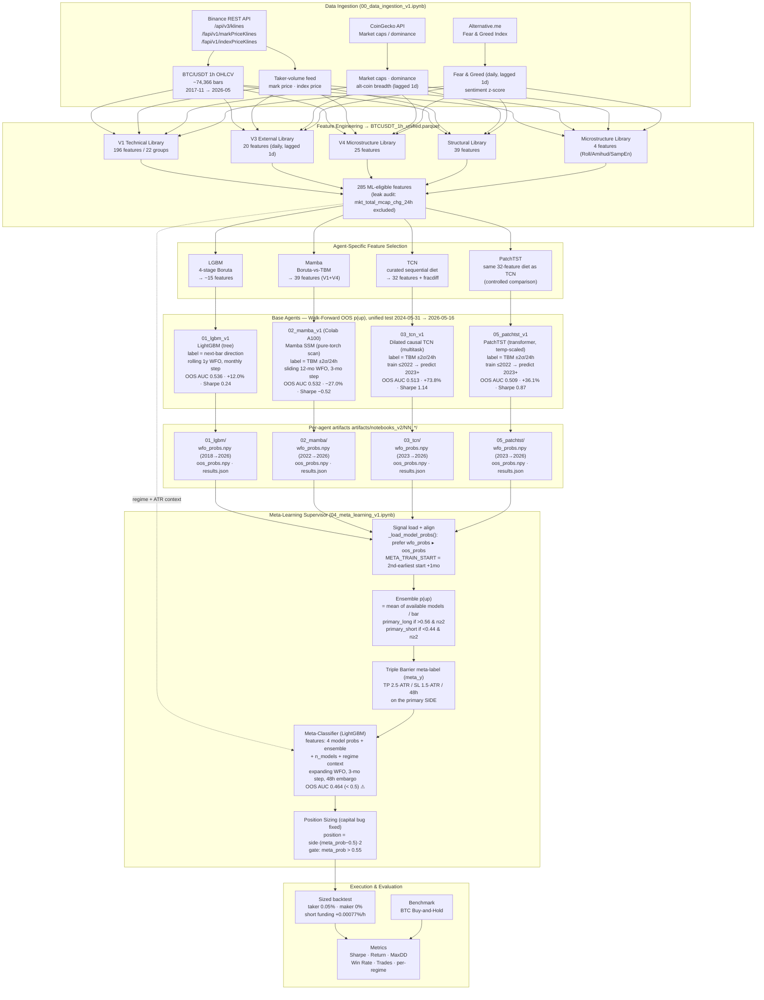

# Hybrid Multi-Agent Trading System — Architecture (notebooks_v2)

> **Status 2026-06-11.** This document describes the **as-built `notebooks_v2/` pipeline**:
> four base agents (LGBM, Mamba, TCN, PatchTST) feeding a LightGBM meta-learner (`04_meta`),
> evaluated on the unified 2-year OOS window **2024-05-31 → 2026-05-16**.
> The earlier DRL+GP / `08_meta` / OOS-2024-01 design has been retired from the live ensemble
> (DRL and GP remain documented in the thesis as standalone experiments only).
> Companion charts: `docs/diagrams/{agent_communication,feature_pipeline,meta_dataflow}.md`.
> Full diagnosis of current meta performance: `docs/meta_analysis_2026-06-11.md`.

## Full Pipeline

## Agent Signal Types

| Agent | Artifact signal | Range | Paradigm | Label |
|-------|-----------------|-------|----------|-------|
| 01 LGBM | `lgbm_p_up` | [0, 1] continuous | Gradient boosting (tabular) | next-bar direction |
| 02 Mamba | `mamba_p_up` | [0, 1] continuous | Selective state-space (SSM) | TBM ±2σ / 24h |
| 03 TCN | `tcn_p_up` | [0, 1] continuous | Dilated causal CNN (multitask) | TBM ±2σ / 24h |
| 05 PatchTST | `patch_p_up` | [0, 1] continuous (temp-scaled) | Patch transformer | TBM ±2σ / 24h |
| **04 Meta** | **position** | **[−1, +1] continuous** | **Meta-labeling (LightGBM)** | TBM on primary side |

> ⚠ **Label heterogeneity:** LGBM predicts a *next-bar direction* event; the three deep
> models predict a *TBM ±2σ/24h* event. `ensemble_p_up = mean(...)` averages probabilities
> of different events — a known limitation (analysis §3c, task T4).

## Walk-Forward OOS Configuration

| Agent | Train scheme | Step | wfo_probs coverage | Reproducible? |
|-------|--------------|------|--------------------|---------------|
| 01 LGBM | expanding 1y rolling WFO | monthly | 2018 → 2026 | yes (`random_state`) |
| 02 Mamba | sliding 12-mo WFO | 3 months | 2022 → 2026 | **no — torch unseeded (T2)** |
| 03 TCN | chronological (train ≤2022) | — | 2023 → 2026 | mostly (DataLoader gen — T3) |
| 05 PatchTST | chronological (train ≤2022) | — | 2023 → 2026 | mostly (DataLoader gen — T3) |
| 04 Meta | expanding WFO on signals | 3 months | trains <2024-05-31, tests after | yes (`random_state`) |

## Current Status & Known Issues (2026-06-11)

The meta-learner currently **underperforms every base model** (OOS AUC 0.464 < 0.5, return −4.1%).
This is an *integration*-layer problem, not a base-model problem (TCN +73.8% / PatchTST +36.1%
standalone). Three compounding causes, with fixes tracked in `docs/TASKS_meta_overhaul.md`:

1. **Regime memorisation** — top meta feature is `halving_cycle_pos` (monotonic time index) → **T7**.
2. **Short-biased primary signal** — base grids tuned on a 2022→2024-05 bear/chop window → **T6**.
3. **Discarded tuned edge + mixed label semantics** — meta ignores each agent's `best_params`
   and averages heterogeneous-label probabilities → **T4 / T5**.

The −100% sizing wipeout (capital-accounting bug) was fixed on 2026-06-11 (**T1**).
